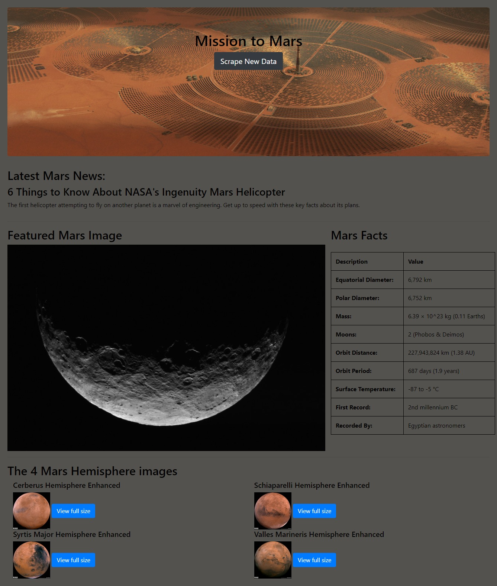

# Mission-to-Mars

## This repo demonstrate using a suite of tools, such as Python, Splinter, BeautifulSoup, Pandas, Flask, MongoDB, HTML with BootStrap and inline styling, etc, to perform scraping of various data on Mars from other websites.  The data is manipulated and stored in MongoDB, and presented to my own web pages.  

  

